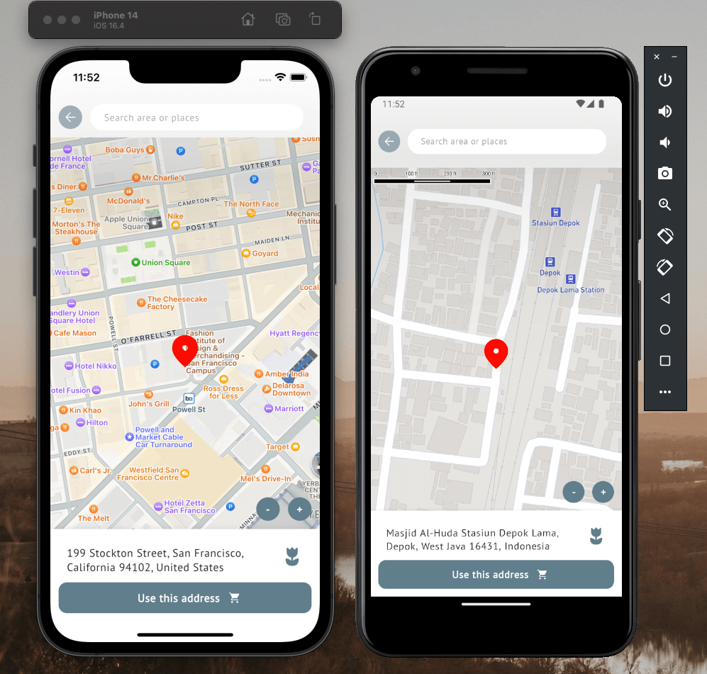

# TokoBola

An online football store simulation application for Android and iOS, developed using the latest
technology from Kotlin Multiplatform and Compose Multiplatform as the UI framework.

This is a playground project and not serious. This project is being worked on periodically, with the
goal of learning Kotlin Multiplatform, Compose for Multiplatform for Android and iOS, and many other
things. I chose the marketplace theme because by developing this themed application, there's so much
that can be learned, starting from architecture, local database, up to maps.

## Architecture

This main architecture combines MVVM with state management, and I call it MVVM + State. This state
is not like MVI, which has multiple states for each flow. I only create 4 conditions, namely Idle,
Loading, Success, and Failure. These states are propagated from data sources to nodes to be rendered
according to their respective needs.

  

## Third party library

- [moko-resources](https://github.com/icerockdev/moko-resources)
- [moko-geo](https://github.com/icerockdev/moko-geo)
- [Voyager](https://voyager.adriel.cafe/)
- [Compose ImageLoader](https://github.com/qdsfdhvh/compose-imageloader)
- [Realm Kotlin](https://realm.io/realm-kotlin/)

|    |    |
|--------------------|--------------------|
|    |    |
| ------------------ | ------------------ |
|    |    |